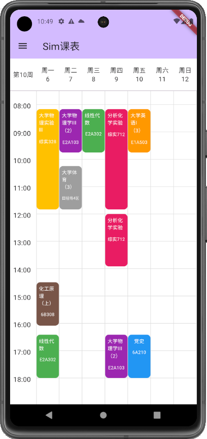

# Sim TimeTable

Sim TimeTable can help students of Chengdu University of Technology (CDUT)  conveniently view their academic affairs system information, including class schedules, grades and examination plans, etc.Sim TimeTable will never collect or upload your private information, which means your data is only processed and analyzed locally.

## Preivew

## Installing

- Android

  Open Realease on the right side of this page and find the installation package with the suffix apk to start installation and use.

- iOS

  Just join in our beta test on TestFlight.You should first install TestFlight and click this [invite link](https://testflight.apple.com/join/VpMbVSXl).

## Feature & Todo

- [x] Bachor supported
- [x] TimeTable
- [x] Grades
- [x] Exams
- [x] Social exams
- [x] Local data save only
- [ ] AutoRefresh
- [ ] Desktop widget supported
- [ ] Search books Online
- [ ] Grades analyze
- [ ] Add custom course schedule
- [ ] Electricity bill
- [ ] Master/Doctor supported
- [ ] More

## Contribute & issue

Thank you to all the people who already contributed to Sim TimeTable!

Please do not commit your changes directly to the master branch, you can commit to the Dev branch. 

If you have any good suggestions, please put them in the issue.
